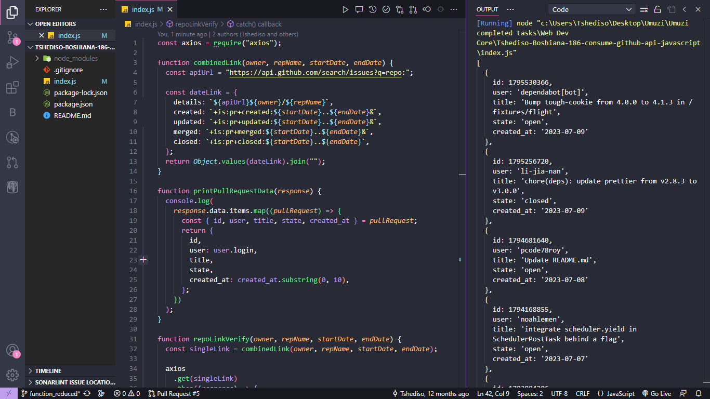

# Project Showcase: `Consume Github API`

# How to install and run the project
In the project directory, you can run:
### `npm install` 

## Overview

Project centers around exploring API consumption using GitHub's API V3 and curl, with a focus on developing a versatile function named 'get pull requests.' This function takes input parameters such as owner, repository name, start date, and end date to retrieve a list of pull requests created, updated, merged, or closed within the specified timeframe. 
 
## Technologies Used

- **JavaScript:** A JavaScript library for building mobile user interfaces.
- **Axios** For making HTTP requests to fetch data from the GitHub API.

## Contact

For any inquiries or questions, feel free to reach out to Tshediso at [tshedisoboshiana@gmail.com](mailto:tshedisoboshiana@gmail.com).

Other projects can be found at [projects](https://projects-5584f.web.app/)

Happy exploring! 🚀